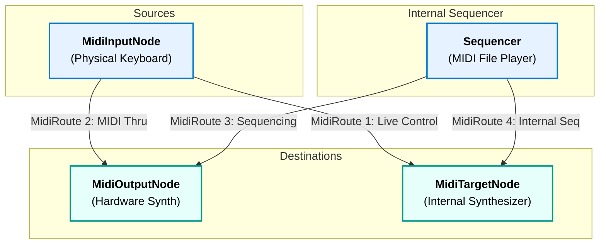

---
id: 13.2
title: MIDI Routing (The Virtual Patch Bay)
description: A guide to connecting MIDI sources to destinations using the MidiManager's routing system to create live signal paths.
navOrder: 13.2
category: MIDI
---

# MIDI Routing (The Virtual Patch Bay)

While direct device interaction is useful, the true power of SoundFlow's MIDI system lies in its routing capabilities. The `MidiManager` acts as a **virtual patch bay**, allowing you to create flexible, live signal paths that connect various MIDI sources to various destinations. This guide explains the core concepts of the routing graph and provides practical examples for common scenarios.

## 1. Introduction to the Routing Graph

The routing system is built on a simple but powerful concept: connecting an `IMidiSourceNode` to an `IMidiDestinationNode` via a `MidiRoute`.

*   **`IMidiSourceNode`**: Represents any component that can **originate** a stream of MIDI messages.
*   **`IMidiDestinationNode`**: Represents any component that can **receive** and process MIDI messages.
*   **`MidiRoute`**: Represents a single, active connection or "patch cable" between one source and one destination. It listens for messages from the source and forwards them to the destination.

This model allows you to decouple your MIDI hardware from your internal sound-generating or processing components, creating a flexible and modular system.

## 2. The Nodes of the Graph

SoundFlow provides several concrete node implementations for building your routing graph.



### Source Nodes (`IMidiSourceNode`)

These are the starting points of your MIDI signal flow.

*   **`MidiInputNode`**: This node wraps a physical MIDI input device, like a USB keyboard or MIDI interface. It is created and managed by the `MidiManager` via the `GetOrCreateInputNode` method. When you play your keyboard, this node emits `MidiMessage` events into the routing system.

### Destination Nodes (`IMidiDestinationNode`)

These are the endpoints of your MIDI signal flow.

*   **`MidiOutputNode`**: This node wraps a physical MIDI output device, such as an external hardware synthesizer or a MIDI interface connected to other gear. It is created and managed by the `MidiManager` via the `GetOrCreateOutputNode` method. When it receives a `MidiMessage`, it sends it out to the physical hardware.

*   **`MidiTargetNode`**: This is a crucial wrapper that makes any internal, `IMidiControllable` component a valid MIDI destination. The most common target is the `Synthesizer` component. When a `MidiTargetNode` receives a message, it simply calls the `ProcessMidiMessage` method on the component it wraps.

## 3. Creating and Managing Routes

The `MidiManager` provides simple, high-level methods for managing these connections.

*   **The `MidiRoute` Class:** This object represents a single, active connection. It is responsible for subscribing to the source node's events and calling the destination node's processing methods. It also serves as the container for real-time `MidiModifier`s, which will be covered in the next guide.

*   **`MidiManager.CreateRoute(...)`:** These convenience methods are the primary way to establish a connection. You provide the source and destination (either as `MidiDeviceInfo` structs or direct `IMidiControllable` instances), and the `MidiManager` handles the creation of the nodes and the `MidiRoute` object for you.

*   **`MidiManager.RemoveRoute(route)`:** This method disconnects a route, unsubscribes it from its source, and removes it from the manager's active list.

## 4. Practical Routing Scenarios

The following complete, runnable examples illustrate the most common routing configurations.

### Scenario 1: MIDI Thru (Physical Input → Physical Output)

**Use Case:** Connecting a MIDI controller directly to an external hardware synthesizer through your computer, effectively using the computer as a "MIDI patch bay" or "MIDI thru box."

```csharp
using SoundFlow.Backends.MiniAudio;
using SoundFlow.Midi.PortMidi;
using System;
using System.Linq;

public static class Program
{
    public static void Main()
    {
        using var engine = new MiniAudioEngine();
        engine.UsePortMidi();
        engine.UpdateMidiDevicesInfo();

        var inputDeviceInfo = engine.MidiInputDevices.FirstOrDefault();
        var outputDeviceInfo = engine.MidiOutputDevices.FirstOrDefault();

        if (inputDeviceInfo.Name == null || outputDeviceInfo.Name == null)
        {
            Console.WriteLine("A MIDI input and output device must be connected.");
            return;
        }

        Console.WriteLine($"Creating MIDI Thru route: '{inputDeviceInfo.Name}' -> '{outputDeviceInfo.Name}'");

        // 1. Create the route.
        // The MidiManager automatically finds/creates the required input and output nodes.
        var thruRoute = engine.MidiManager.CreateRoute(inputDeviceInfo, outputDeviceInfo);

        Console.WriteLine("Route is active. MIDI data is now flowing from input to output.");
        Console.WriteLine("Press any key to disconnect the route and exit.");
        Console.ReadKey();

        // 2. Remove the route to stop the connection.
        engine.MidiManager.RemoveRoute(thruRoute);
        Console.WriteLine("Route disconnected.");
    }
}
```

### Scenario 2: Live Instrument Control (Physical Input → Internal Synthesizer)

**Use Case:** The most common scenario for a software synthesizer—playing an internal instrument with a physical MIDI keyboard.

```csharp
using SoundFlow.Backends.MiniAudio;
using SoundFlow.Midi.PortMidi;
using SoundFlow.Structs;
using SoundFlow.Synthesis;
using SoundFlow.Synthesis.Banks;
using System;
using System.Linq;

public static class Program
{
    public static void Main()
    {
        // 1. Standard engine and device setup
        using var engine = new MiniAudioEngine();
        engine.UsePortMidi();
        engine.UpdateMidiDevicesInfo();
        var format = AudioFormat.DvdHq;
        using var device = engine.InitializePlaybackDevice(null, format);

        var inputDeviceInfo = engine.MidiInputDevices.FirstOrDefault();
        if (inputDeviceInfo.Name == null)
        {
            Console.WriteLine("No MIDI input device found.");
            return;
        }

        // 2. Create the internal sound source (the destination).
        var instrumentBank = new BasicInstrumentBank(format);
        var synthesizer = new Synthesizer(engine, format, instrumentBank);

        // 3. Add the synthesizer to the audio graph to be heard.
        device.MasterMixer.AddComponent(synthesizer);

        Console.WriteLine($"Creating live control route: '{inputDeviceInfo.Name}' -> Synthesizer");

        // 4. Create the route from the physical input to the internal synthesizer.
        var liveRoute = engine.MidiManager.CreateRoute(inputDeviceInfo, synthesizer);

        // 5. Start audio playback.
        device.Start();

        Console.WriteLine("Route is active. Play your MIDI keyboard to hear the synthesizer.");
        Console.WriteLine("Press any key to exit.");
        Console.ReadKey();

        device.Stop();
        engine.MidiManager.RemoveRoute(liveRoute);
    }
}
```

### Scenario 3: Sequencing to External Hardware (Internal Sequencer → Physical Output)

**Use Case:** Using SoundFlow as a MIDI sequencer to play a MIDI file on an external hardware synthesizer.

```csharp
using SoundFlow.Backends.MiniAudio;
using SoundFlow.Components;
using SoundFlow.Metadata.Midi;
using SoundFlow.Midi.PortMidi;
using SoundFlow.Midi.Routing.Nodes;
using SoundFlow.Providers;
using SoundFlow.Structs;
using SoundFlow.Synthesis;
using System;
using System.IO;
using System.Linq;

public static class Program
{
    public static void Main()
    {
        var midiFilePath = "path/to/your/song.mid";
        if (!File.Exists(midiFilePath))
        {
            Console.WriteLine($"MIDI file not found: {midiFilePath}");
            return;
        }

        // 1. Standard engine and device setup
        using var engine = new MiniAudioEngine();
        engine.UsePortMidi();
        engine.UpdateMidiDevicesInfo();
        var format = AudioFormat.DvdHq;
        using var device = engine.InitializePlaybackDevice(null, format); // Device is still needed to drive the Sequencer's clock

        var outputDeviceInfo = engine.MidiOutputDevices.FirstOrDefault();
        if (outputDeviceInfo.Name == null)
        {
            Console.WriteLine("No MIDI output device found to send sequence data to.");
            return;
        }

        // 2. Load the MIDI file.
        var midiFile = MidiFileParser.Parse(File.OpenRead(midiFilePath));
        var midiDataProvider = new MidiDataProvider(midiFile);

        // 3. Get the destination node for the physical MIDI output.
        var outputNode = engine.MidiManager.GetOrCreateOutputNode(outputDeviceInfo);

        // 4. Create the Sequencer.
        // The target is the MidiOutputNode, NOT an internal synthesizer.
        var sequencer = new Sequencer(engine, format, midiDataProvider, outputNode);

        // 5. Add the Sequencer to the audio graph.
        // This is crucial! Although the sequencer doesn't produce audio, it needs to be
        // part of the processing graph to get sample-accurate timing updates.
        device.MasterMixer.AddComponent(sequencer);

        // 6. Start the device and sequencer.
        device.Start();
        sequencer.Play();

        Console.WriteLine($"Playing MIDI file '{Path.GetFileName(midiFilePath)}' to '{outputDeviceInfo.Name}'.");
        Console.WriteLine("Press any key to stop.");
        Console.ReadKey();

        sequencer.Stop();
        device.Stop();
    }
}
```

## 5. Handling Route Failures

A `MidiRoute` can fail during operation. The most common cause is a physical device being disconnected (e.g., a USB cable is unplugged). When this happens, the route enters a **faulted state** (`IsFaulted = true`) and stops processing messages to prevent further errors.

You can be notified of these failures by subscribing to the `MidiManager.OnRouteFaulted` event.

```csharp
// In your application setup code:
engine.MidiManager.OnRouteFaulted += HandleRouteFault;

// ... create routes ...

private static void HandleRouteFault(MidiRoute faultedRoute, IError? error)
{
    // This handler will be called if a route fails.
    Console.WriteLine($"\n--- MIDI ROUTE FAULT ---");
    Console.WriteLine($"Route from '{faultedRoute.Source.Name}' to '{faultedRoute.Destination.Name}' has failed.");
    Console.WriteLine($"Reason: {error?.Message ?? "Unknown error"}");

    // In a real application, you might update the UI to show the disconnected status
    // or attempt to automatically re-establish the route.
}
```